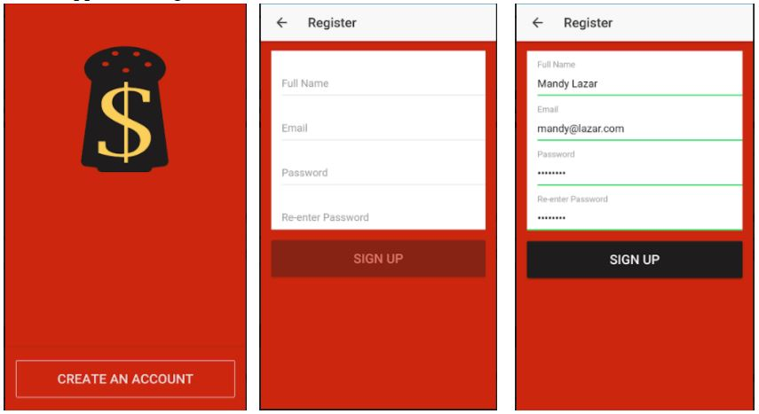
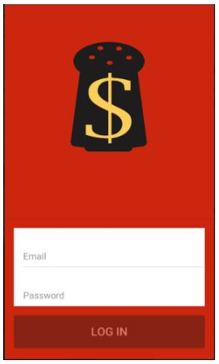
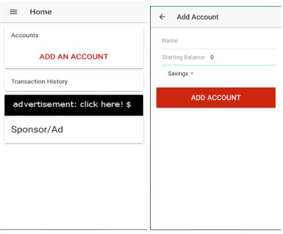
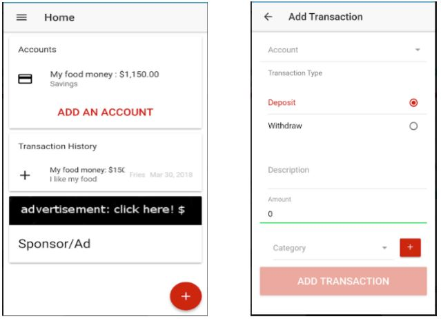
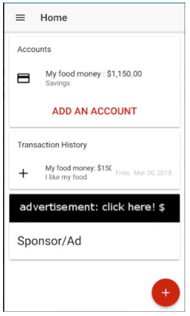
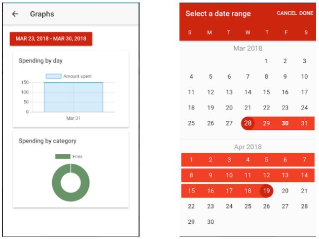

# paprika
COSC 310 Project - Team Paprika

Walkthrough of Paprika Finance App

GitHub Repository Link:
https://github.com/IMRovert/paprika

Running the app:
The app can be run on either an Android device or an Android emulator.

Android device:
Download the apk from the repository and install on device.

Android Emulator:
Download the apk the from repository, run the emulator, and drag the apk onto the emulator window.

Feature Guide:

1. Register/Create account

i)  On the Login page click the “Create an account” button to connect to the Registration page.

ii)  Once there, fill in the required text boxes with the appropriate information.
-Email must be a valid email
-Password must be at least 8 characters in length

iii) Click the “Sign-up” button to confirm registration.

iv) This will redirect to the home page Transaction History.
 If there is an invalid value given for any of the fields, an error message will appear stating the issue.
 
 
		
 
2. Login

i) Provide the appropriate login information in the text boxes and click “Login”.

ii) This will redirect to the home page, Transaction History.
	 If there is an invalid value given for any of the fields, an error message will appear stating the issue.

3. Add account

i) Select the “Add An Account” option from the main page.

ii) Enter the desired account name, initial balance, and account type.

iii) Click “Add account.” The account will be created and added to the database.

4. Add Transaction:

i) On the main page, click the (+) symbol in the bottom right corner.

ii)  Select the account type (i.e. “Savings”,”Chequing”), and the transaction type (i.e. “Deposit”, “Withdraw”).

iii) Enter a description about the transaction.

iv) Enter an amount.

v) Choose a category for the transaction (optional).
-There is an option to manually add a category if necessary. Select the add category   button, and type in the name of the new category to add it to the database. It will then appear in the drop-down category menu.

vi) Click the “Add Transaction” button to add this transaction to the database.	

5. Edit Existing Transaction

i) Starting from the main page listing transactions, click on the + symbol on a transaction to edit it. This will redirect to the edit transaction page.

iii) View instructions i - v for adding a transaction.

iv) Click the “Save Changes” button to save changes to the transaction.

	
6. View graphical information:

i) From the navigation menu, select Graphs.

ii) Choose a start and an end date by clicking the date button at the top of the window and selecting the dates from the calendar.

iii) Transaction information for that time period will appear in graphs and charts.

iv) Drag mouse over/or click charts to see more information.

7.  Import data

i) From the navigation menu, select Import Data.

ii) Select the name of the account you wish to import the file to, and type in the name of the file to import from.

iii) Click the “Import File” button.

iv) Due to an issue in the app framework, the app is currently unable to read/write from the Android emulator’s file system. The current implementation of this functionality uses a string of sample transaction text in .csv format, and processes it as though it were the chosen file. These transactions will be added to the the selected account.

8. Export data

i) From the navigation menu, select Export Data.

ii) Select the name of the account you wish to export the data to, and type in the name of the file you would like to create and export the data to.

iii) Click the “Export File” button.

iv) Due to an issue in the app framework, the app is currently unable to read/write from the Android emulator’s file system. The current implementation of this functionality reads the selected account’s transactions from the database, processes them into standard .csv format, and alerts the text to the user.

9.  Logout

i) Select the main menu and click the “Logout” button or simply close the app.

